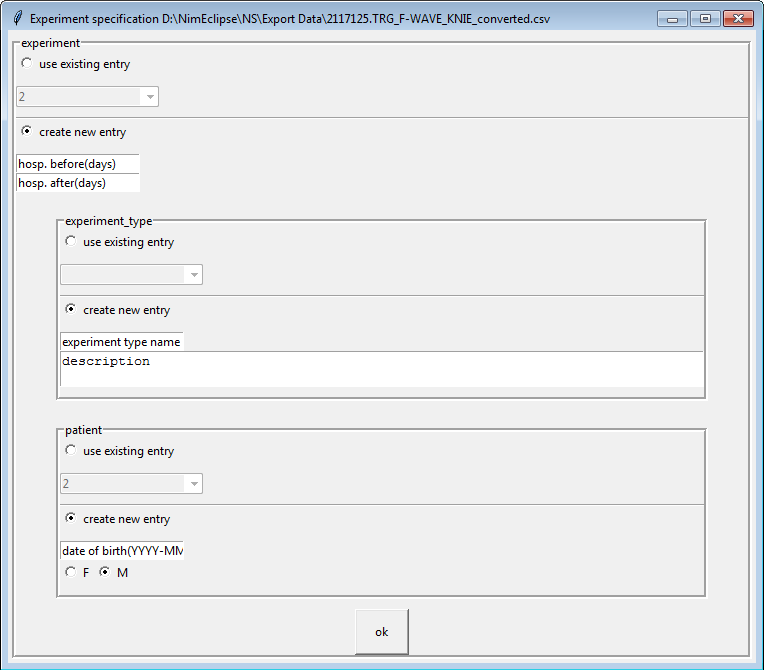

# IONM Analysis Toolbox #
#### Internship project realized at the Department of Neurosurgery within the University Medical Center Groningen ####
*DISCAIMER: This application was created for the UMCG during an internship. Without the python project (for obvious reasons not shared publicly) containing the required analyis tools this application simply has no purpose.*

The Intraoperative Neurophysiological Monitoring (IONM) Analyis Toolbox is a graphical user interface (GUI) designed to make the usage of IONM Analysis tools more user friendly. This application has been developed during an internship at the Department of Neurosurgery in the University Medical Center Groningen. It has been written in JavaScript using the popular open-source framework named Electron. Electron allows for the development of desktop GUI applications using web technologies. 
The motivation for this project comes from the thought that the more user-friendly the tools and thus research on IONM Analysis, the more progress could be made in the future

Intraoperative Neurofysiological Monitoring consists of continuously monitoring the nervous system during the surgery at which the nervous system is at risk. During this process, the function an integrity of the nervous system can be monitored in order to detect and prevent surgical induced neurological trauma. Those techniques were initially created to detect damage and suppression of the nervous system as early as possible. By detecting this as early as possible, potential further damage can be prevented.  
The data collected during a surgery is influenced by quite some parameters, and because of this it is hard to tell exactly when a surgery is getting too risky to proceed. Whenever high-risk spinal surgery is performed, neurophysiological data is collected. This data can be pre-processed by the program, and afterwards statistical analysis can be performed on this data. This all for the purpose of researching if the data could tell us more.


## Table of Contents ##
* [Installation](#install)
  1. [Python](#python)
  2. [Pip and the required dependencies](#pip-and-the-required-dependencies)
  3. [Microsoft Access / Microsoft Access Database Engine drivers](#microsoft-access-and-the-microsoft-access-database-engine-drivers)
  4. [IONM Analysis Toolbox](#ionm-analysis-toolbox-1)
* [Usage](#usage)
  1. [Via the command line](#command-line)
  2. [Using the IONM Analysis Toolbox](#ionm-analysis-toolbox-2)
* [Version Information](#version-information)
* [Recommended system requirements](#recommended-system-requirements)
* [Contacts](#contacts)


## Install ##

*Instructions below outline installation and set up for **windows** only.*

### Python ###
First, install python (version 3.7.1 or newer) through their [website](https://www.python.org). **Make sure to check the 
'add python to PATH' box while installing**. To confirm that python was added to the `PATH` system variable, open the command prompt (type 'cmd' in the windows search bar) and type `python`. If python was installed correctly, the python interpreter should start and output something like below:

```
Python 3.7.4 (tags/v3.7.4:e09359112e, Jul  8 2019, 19:29:22) [MSC v.1916 32 bit (Intel)] on win32
Type "help", "copyright", "credits" or "license" for more information.
>>>
```

To quit python and return to the command prompt, type `quit()`.
If python does not start upon typing `python`, you may have to [add python to the PATH variable](https://geek-university.com/python/add-python-to-the-windows-path/).

### Pip and the required dependencies ###
The main Python script which runs all tools (ionm.py) depends on the following packages:
- Scipy (depends on and auto-installs numpy)
- Matplotlib (depends on and auto-installs pyparsing, six, python-dateutil, cycler and kiwisolver)
- Pyodbc
- Sqlparse
- Pandas
- Scikit-learn
- Joblib

Dependencies can easily be installed using [pip](https://pypi.org/project/pip/). Pip is the package installer for Python. Pip should already been installed along with Python, so hopefully that's one less thing we have to worry about.  
If executing `pip` from anywhere in a command prompt generates a pip help message, pip is installed successfully. In that case, you can skip the following paragraph. If it doesn't create a pip help message, try the following solution:

You will have to navigate to the python its source folder to install dependencies using pip.  
Open a command prompt and type (replace the parentheses parts):  
`cd C:\Users\(Your logged in User)\AppData\Local\Programs\Python\(Your python version)\Scripts`  
Now try using the `pip` command again. If it generates a pip help message, skip the following paragraph. If it doesn't create a pip help message, try the following solution:

Pip might not be installed at all. Open a command prompt and type `python` following a single space and then drag the get-pip.py file into the command prompt. If you did it correctly, you should have something like this:  
`python "C:\Users\(Your logged in User)\Downloads\get-pip.py"`.  
If you do, hit enter and let it do its thing. If its done and you're able to type again. Try using the `pip` command once again. It should now produce the pip help message. You can now proceed to installing the packages.

To install the packages, type:  
`pip install scipy matplotlib pyodbc sqlparse pandas sklearn joblib`.  
Hit enter. This will install all required packages and their dependencies.

Now, to test if all dependencies have been successfully installed, head into the python project folder using something like:  
`cd path\to\python\project`.  
Once in there, type `ionm.py` and hit enter. If all dependencies are there this should produce a help message which describes how to use the command line interface. You can now safely close the command prompt.

### Microsoft Access and the Microsoft Access Database Engine drivers ###
[Microsoft Access](https://products.office.com/nl-nl/access?rtc=1) is the database program that is used by ionm.py to store signal-derived statistics.
It comes with most versions of the Microsoft Office software. ionm.py was tested with Microsoft Access version 1901.

The Python project communicates with databases using the  [Microsoft Access Database Engine 2010 Redistributable driver](https://www.microsoft.com/en-US/download/details.aspx?id=13255). Please install those drivers, but **be sure to download the 32bit version**, since the application will be published in 32bit only.

### IONM Analysis Toolbox ###

The latest version of the IONM Analysis Toolbox can be downloaded [here](https://github.com/olledejong/IONM-Analysis-Toolbox/releases/latest). Execute it once its successfully downloaded and install it within a few clicks. Is it really that easy? Yes it is.

## Usage ##

### Command line ###

#### Version ####
Open the command prompt and type `ionm.py version`. This will print version information to the screen, together with
the developer's contact information:
```
->ionm.py version
name: ionm.py
author: Johan Schneiders and Menno Gerbens
maintainer: Menno Gerbens
        ['m.j.gerbens@st.hanze.nl', 'm.j.gerbens@umcg.nl', 'johan.schneiders@live.com']
credits: ['Gea Drost', 'Fiete Lange', 'Sebastiaan Dulfer']
version: 1.3
        production
```

#### Summarize ####
Usage: 
    ```ionm.py summarize [-h] files [files ...]```
Type `ionm.py summarize ` followed by one or more paths to CSV files generated by the Medtronic NIM-Eclipse E4 IONM 
system. This will print some basic information about the file to the screen: 
```
->ionm.py summarize ..\data\scoliose\scoliose_trg.csv
####################################################################################################
--<C:\Users\Johan\PycharmProjects\ionm\data\scoliose\scoliose_trg.csv>--
File size: 33,744,288 bytes (3,123 lines)
meta:
        Test name: Scoliose_met_drempel_DEF
        Test date: 31-7-2018 08:03:50
modalities:
        TES MEP: 2,800 lines
        H Reflex: 48 lines
        MEP Drempel: 130 lines
        CMAP: 138 lines
####################################################################################################
```

#### Show timing ####
Usage: `ionm.py show_timing [-h] files [files ...]`

Type `ionm.py show_timing` followed by one or more paths to CSV files generated by the Medtronic NIM-Eclipse E4 IONM 
system. This will generate a plot showing timestamps at which IONM measurements were made. The program will generate a 
separate plot for each file. Below is an example of one such plot:

`ionm.py show_timing ..\data\scoliose\scoliose_trg.csv`


Every dot represents a single measurement. In the case of triggered modalities, this represents a single response over
all channels. In the case of EEG or some other free running modality, this represents one second worth of recording.


#### Show EEG availability ##### 
Usage: `ionm.py show_availability [-h] -c CONTINUOUS_FILE -t TRIGGERED_FILE [-w WINDOW_SIZE]`

Generates a plot showing when an EEG context is available for given evoked
potentials. You may specify more than one file, in which case a new plot is generated for every file. 
Below is an example of one such plot:

`ionm.py show_availability -c ..\data\scoliose\scoliose_eeg.csv -t ..\data\scoliose\scoliose_trg.csv -w 5`


The black dots represent the timing of the EEG, as in the `show_timing` subcommand. Every horizontal line represents 
measurement of a triggered modality. For these lines, only their height(position on the y-axis) is relevant. They are
colored green if an EEG context is available and red otherwise. The size of the required EEG context is specified 
through the `-w` or `--window_size` argument and defaults to one second before and one second after the triggered 
modality.

#### Convert ####
Usage: ` ionm.py convert [-h] [-w NAME_WRAPPER] files [files ...]`

Converts one or more csv files (as generated by the Medtronic NIM-Eclipse E4 IONM system) to a custom format. This
custom format is used in the `compute` subcommand. 

The `-w` or `--name_wrapper` argument specifies the suffix used for name generation. For example, `ionm.py convert 
test.csv -w _converted` will result in the file `test_converted.csv`. 
This argument defaults to '_converted'.

#### Compute ####
Usage: `ionm.py compute [-h] -f FILES [FILES ...] -s {all,p_p_amplitude,auc} [{all,p_p_amplitude,auc} ...]`

Computes statistics for one or more converted csv files and sends resulting statistics to the database 
(please see [setup database](#setup)). 

Directly after typing the program call, a popup will appear in which to specify the experiment/operation from which the 
IONM data were generated:



This popup is connected to the database and allows you to either select an existing entry or specify a new one. 
After filling in the forms, click "ok" to submit. If any fields were assigned an invalid value, they will be marked by 
a red border and you will have to supply a valid entry before the program continues. 

When the experiment specification passes, a new popup will appear in which you can specify which signals to keep for 
further analysis and what time window should be used for calculation of signal-derived statistics.

#### Extract EEG #### 
Usage: `ionm.py extract_eeg [-h] -c CONTINUOUS_FILE -t TRIGGERED_FILE`

Creates a file with the combined evoked potentials and the eeg context available within the window size around
these evoked potentials.

`ionm.py extract_eeg -c ..\data\scoliose\scoliose_eeg.csv -t ..\data\scoliose\scoliose_trg.csv`

The output files will have the same name as the triggered file with the addition "_EXT_EEG".
So for this example the output file will be: "scoliose_trg_EXT_EEG.csv"

#### Validate ####
Usage: `ionm.py validate [-h] -f FILE`

Creates validation screens for the user to exclude artifact data in the combined EEG, TES MEP data and will create a new file without this artifact data.

`ionm.py validate -f ..\data\scoliose\scoliose_trg_EXT_EEG.csv`

The output files will have the same name with the addition "_VALIDATED". This example will get the output file
"scoliose_trg_EXT_EEG_VALIDATED.csv".

#### Combine ####
Usage: `ionm.py combine [-h] -f FILE -p PATIENT_ID`

Combines the data from the database with the output of the graphical analysis data.   
The `-p` or `--patient_id` argument gets used for adding the patient id to the output file.

`ionm.py combine -f "D:\IONM\Data\JW Output\TESMEP_EEG_1.csv" -p 1`

The output files will have the same name with the addition "_COMBINED". The output of the example above
will be: "TESMEP_EEG_1_COMBINED.csv"

#### Classify ####
Usage:    `ionm.py classify [-h] -f FILE`

Classifies signals in a file on the presence of F-waves

After running this a screen will pop up similar to the sceen below.
 
In this screen you can set the ranges around the F-waves.
After this a second screen wil pop up where you can correct the program and specify which signals are wrong by 
clicking on them.

#### Setup ####
Before the program can send signal-derived statistics to the database, you must first create a database with all
required tables set up. To do so: 
1. Create an empty Microsoft Access database at your desired location. Opening the file should start Access and show an empty database.
2. Using windows explorer, copy the absolute path to the database (shift+right click-> copy as path)
3. Open `config.ini` and paste the absolute path in the designated field(right after `database file = `).
4. Save `config.ini`
5. Go to the command prompt and type `ionm.py setup`

After running `ionm.py setup`, opening the database file should start Access and show a database with empty tables.

### IONM Analysis Toolbox ###
Since the IONM Analysis Toolbox is a Graphical User Interface for the purpose of making it easier to work with IONM Analysis tools, most of the application should speak for itself when you get a little familliar with it. But if it does not, don't worry, here are some usefull descriptive usage paragraphs for every section of the application.

#### Summarize the information of a file (Summarize) ####
Using this tool you will be able to retrieve some basic information about exported Eclipse files. Select one or more files and hit the run button to generate table for all selected files. This table contains information such as: path to the file, file size, file name, date of measuring, duration of measurement and which types of modalities are present in the file.  

To use this tool, click the orange part which contains the text "Click to select". After doing this, a file selection window should open. From there, select the file (or files) you would like to execute the tool on. When you've selected at least one file, a "RUN" button will appear. Click this to generate a table containing some information about the selected Eclipse files.

#### Show all measurements that a file contains (Show Timing) ####
Using this tool you will be able to plot all timestamps present in an Eclipse file. In the plot the timestamps of measurements are plotted as a function of the position in file. Because of that, this tool is useful to get insight into which measurements (including the modality type of the measurement) were made at which time.  

To use this tool, click the orange part which contains the text "Click to select". After doing this, a file selection window should open. From there, select the file (or files) you would like to execute the tool on. When you've selected at least one file, a "RUN" button will appear. Click this to generate a plot where the timestamps of measurements are plotted as a function of their position in file.

#### Show EEG availability (Show Availability) ####
Using this tool you will be able to get an idea of how much EEG data is available around evoked potentials. The 'Window Size' argument exists to let you select in what range the EEG data should be available around the evoked potentials. Setting a Window Size of 1 tells the script to label every evoked potential which has 1 second of EEG available before and after as 'EEG available'. All evoked potentials which do not have the 1 second of EEG available will be labeled 'EEG not available'.

To use this tool, you will have to select an EEG as well as a TRG file. To select an EEG file click the orange part which contains the text "Click to select an EEG file". After doing this, a file selection window should open. From there, select the EEG file you would like to execute the tool on. Do the same thing for the TRG file. Be sure not to switch them up, though.  

After selecting the files, you will have to choose the "Window Size". Select this number by clicking the little arrows that appear once you hover over the white field. Alternatively, you can also type a number into the field. The "Window Size" argument can be 1 up to 10 (seconds).  
When you've selected both files and you've set the "Window Size", the "RUN" button will be enabled. Click this to generate a plot which shows you exactly when there is EEG data available around evoked potentials.

#### Convert TRG files (Convert) ####
This tool is a preprocess tool to eventually compute the statistics of the Eclipse files. It will convert Eclipse CSV files into multiple custom files: one separate file per modality.
All the modalities that the file, or files, contain should be already in the known modalities table. If not, the converting of the file that contains unknown modalities will fail (how to handle this will be described later). 

To use this tool, click the orange part which contains the text "Click to select". After doing this, a file selection window should open. From there, select the file (or files) you would like to execute the tool on. When you've selected at least one file, a "RUN" button will appear. Click this to convert the selected files into seperate files (one per modality).

**If** the programm encounters unknown modalities, forms will appear where you can fill out the needed information. Since the names are given already it isn't that big of a deal to fill out the forms. After you're done, simply click the 'submit all' button to insert the new modalities into the modalities table. After some time, messages telling the modalities have been stored successfully should popup. Since you came here to convert files, you can re-run the convert task for all the files that initially failed. Do this by clicking the "Re-run failed converts" button.

The output file(s) will have the same name as the input file, but with the addition "_converted".

#### Compute statistics (Compute) ####
This tool will compute the statistics the user wishes to compute and store these in the configured database (can be changed in the settings). Determining what statistics will be calculated can be done by selecting a possibility from the statistical options list. For now these are: 'all', 'p_p_amplitude' and 'auc'. In the future there might be additional statistics that can be computed.

To use this tool, click the orange part which contains the text "Click to select". After doing this, a file selection window should open. From there, select the file (or files) you would like to execute the tool on. After this, select what statistics you would like to compute by selecting an option from the drop-down list in the "Statistics" box.
Once you've selected at least one file and the statistics you wish to compute, the "RUN" button will be enabled. Click this to start the process.

After clicking the run button you will have to fill out an experiment form. Do this accurately, since it contains critical information. Once its filled out correctly and you have clicked the "ok" button, windows containing signals will appear. In these you can deselect signals or change the ranges of which the statistics will get computed.  
Once you are trough all the signal windows, a success message should appear.

#### Extract available EEG (Extract) ####
Using this tool, you will be able to extract all evoked potentials along with its EEG data for which enough EEG data is available. Since the window size parameter isn't fully dynamic as it is for the 'show availability' tool, it has for now been hard-coded in the backend python script. So, currently it is set to a window size of 6 seconds around an evoked potential.  

To use this tool, you will have to select an EEG as well as a TRG file. To select an EEG file click the orange part which contains the text "Click to select an EEG file". After doing this, a file selection window should open. From there, select the EEG file you would like to execute the tool on. Do the same thing for the TRG file. Be sure not to switch them up, though. When you've selected both files, the "RUN" button will be enabled.

The output file will have the same name as the input file, but with the addition "_EXTR_EEG".

#### Validate the extracted file (Validate) ####
Extracted files may contain signals which have artifacts. By using this tool you will be able to omit signals which contain artifacts. Validation screens will be created, which can be used by the user to exclude artifact data in the combined EEG, TES MEP data. This results in a new file which does not contain the omitted signals. 

To use this tool, you will have to select an extracted file. To select an extracted file click the orange part which contains the text "Click to select an extracted file". After doing this, a file selection window should open. From there, select the extracted file you would like to execute the tool on. 
When you've selected a file, and the selected file is in fact an extracted file, the "RUN" button will be enabled.

The output file will have the same name as the input file, but with the addition "_VALIDATED"

#### Combine database statistics with Graphical Analysis Data (Combine) ####
Using this tool you will be able to combine the data from the configured database with the output of the graphical analysis data program created by Jan-Willem. The 'Patient ID' argument gets used for adding the patient identifier to the output file which contains the database data as well as the output of the graphical analysis data program. 

To use this tool, you will have to select a file which has to be in the format of the output of Jan-Willem his graphical analysis programm. To select such a file click the orange part which contains the text "Click to select". After doing this, a file selection window should open. From there, select the file you would like to execute the tool on. 

When you've selected a file, you also have to give a patient ID within the "Patient ID" box. Select this number by clicking the little arrows that appear once you hover over the white field. Alternatively, you can also type a number into the field. If you've done these two things, the "RUN" button will be enabled.

The output files will have the same name as the input file, but with the addition "_COMBINED"

#### Classify for F-waves (Classify) ####
_Not fully functional at the moment and thus disabled_

#### Application Settings ####
Within the settings of the IONM Analysis Toolbox you will find six distinct sections with each its own function. Below will follow an elaboration on each of those sections.

**_Set Python src directory_**  
Within this section you are able to let the IONM Analysis Toolbox know where the python project, created by Johan Schneijders and Menno Gerbens, is located. The IONM Analysis Toolbox is entirely dependent upon the python project, and therefor this is the first setting you would want to configure.  
To configure this setting, select the python src directory by clicking the "Select" button within the "Set python src directory" section. Once you have selected and 'opened' the right directory, its path will be displayed within the white text field. Double check if it is the right directory, and then click "Set src directory".

**_Set default select directory_**  
This section is solely for the use of user convenience. Using this section, you can select and set the default path the file / directory selection window opens in. If you for example have a data folder which you are working with all the time, consider configuring that directory as the default select directory.  
To configure this setting, select the wanted default select directory by clicking the "Select" button within the "Set default select directory" section. Once you have selected and 'opened' the right directory, its path will be displayed within the white text field. Double check if it is the right directory, and then click "Set default select path".

**_Set database_**  
Once the python src directory has been correctly configured, you can use this section to set the database which will be used to write data to. When using the command line, you would have to set the database by going into the python project and copying the absolute path to a config file. That is not needed anymore if you use the IONM Analysis Toolbox.
To configure this setting, select the database (.accdb extention only) by clicking the "Select" button within the "Set database" section. Once you have selected and 'opened' the right database, its path will be displayed within the white text field. Double check if it is the right database, and then click "Set database".

**_Setup a new database_**  
Whenever you create a new Microsoft Access Database, you will have to setup and create empty tables which can be filled later. This process is meant **only for new and empty databases!** Be very thoughtful when using this tool. If you (mistakenly) setup a database which is already in use and potentially full of data, you **will** delete all of its content or corrupt the database.  
The currently set database its path is displayed within the white textfield. The only think you have to do to setup the database is click the "setup database" button.

**_Configure the modalities_**  
Every database that has been setup contains a modalities table. In this table all encountered modalities will be stored. In this section of the settings, you can see which modalities already exist in the (configured / active) database. You can also manually add a modality to the modalities table.  
You can add a modality to the modalities table by first clicking the "add modality" button. When you click this, a form will appear. In this form, fill out the modality its name, the type and the strategy. After this, hit the "submit" button to add the modality to the database.

**_Trace selection settings_**  
Within this section there is for now only one setting. More could be implemented in the future, but untill now that was not needed. The one setting regarding the trace selection system (used in the compute and validate tools) is the "Chunk Size". This setting determines how many signals will be displayed at once in a window. 
You can set this value by clicking the little arrows that appear once you hover over the white field. Alternatively, you can also type a number into the field. Once you set a value of choice, click the "submit settings" button to save the settings.

## Version Information ##

All information about the IONM Analysis Toolbox app, as well as the initial Python Project its information, can be found within the IONM Analysis Toolbox app under the 'About' section. This information also includes the version information.  
On every start-up the application checks whether there is an update available. It does this by checking the project its [Github releases page](https://github.com/olledejong/IONM-Analysis-Toolbox/releases).

## Recommended system requirements ##

|               | Windows only           |
| ------------- |:----------------------:|
| CPU           | Intel Core i3 or higher|
| MEMORY        | 4GB or more            |
| FEE SPACE     | About 200MB            |

## Contacts ##

- Python IONM analysis project, initiated by Johan Schneiders.
  * johan.schneiders@live.com
- Python IONM analysis project, expanded and optimized by Menno Gerbens.
  * m.j.gerbens@st.hanze.nl
  * mennogerbens@gmail.com
- IONM Analysis Toolbox, developed by Olle de Jong.
  * ol.de.jong@st.hanze.nl
  * olledejong@gmail.com

