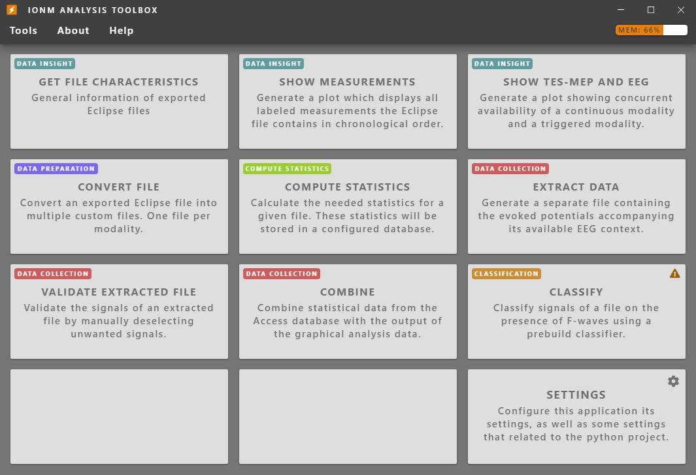

# IONM Analysis Toolbox #
#### Internship project realized at the Department of Neurosurgery within the University Medical Center Groningen ####
*DISCAIMER: This application was created for the UMCG during an internship. Without the python project (for obvious reasons not shared publicly) containing the required analyis tools this application simply has no purpose.*

The Intraoperative Neurophysiological Monitoring (IONM) Analyis Toolbox is a graphical user interface (GUI) designed to make the usage of IONM Analysis tools more user friendly. This application has been developed during an internship at the Department of Neurosurgery in the University Medical Center Groningen. It has been written in JavaScript using the popular open-source framework named Electron. Electron allows for the development of desktop GUI applications using web technologies.
**To be expanded..**  



## Table of Contents ##
* [Installation](#install)
  1. [Python](#python)
  2. [Pip and the required dependencies](#pip-and-the-required-dependencies)
  3. [Microsoft Access / Microsoft Access Database Engine drivers](#microsoft-access-and-the-microsoft-access-database-engine-drivers)
  4. [IONM Analysis Toolbox](#ionm-analysis-toolbox-1)
* [Usage](#usage)
  + [Via the command line](#command-line)
  + [Using the IONM Analysis Toolbox](#ionm-analysis-toolbox-2)
* [Version Information](#version-information)
* [Recommended system requirements](#recommended-system-requirements)
* [Contacts](#contacts)


## Install ##

*Instructions below outline installation and set up for **windows** only.*

### Python ###
First, install python (version 3.7.1 or newer) through their [website](https://www.python.org). **Make sure to click the 
'add python to PATH' button on the installation wizard**. To confirm that python was added to the `PATH` system variable,
open the command prompt(type 'cmd' in the windows search bar) and type `python`. If python was installed 
correctly, the python interpreter should start and output something like below:

```
Python 3.7.4 (tags/v3.7.4:e09359112e, Jul  8 2019, 19:29:22) [MSC v.1916 32 bit (Intel)] on win32
Type "help", "copyright", "credits" or "license" for more information.
>>>
```

To quit python and return to the command prompt, type `quit()`.
If python does not start upon typing `python`, you may have to [add python to the PATH variable](https://geek-university.com/python/add-python-to-the-windows-path/).

### Pip and the required dependencies ###
The main Python script which runs all tools (ionm.py) depends on the following packages:
- Scipy (depends on and auto-installs numpy)
- Matplotlib (depends on and auto-installs pyparsing, six, python-dateutil, cycler and kiwisolver)
- Pyodbc
- Sqlparse
- Pandas
- Scikit-learn
- Joblib

Dependencies can easily be installed using [pip](https://pypi.org/project/pip/). Pip is the package installer for Python. To install pip, the file [get-pip.py](https://bootstrap.pypa.io/get-pip.py) needs to be downloaded and executed using Python. To do this, open a command prompt (cmd) and type `python` and a single space. Then drag the get-pip.py file into the command prompt. If you did it correctly, you should have something like this: 
`python "C:\Users\(Your logged in User)\Downloads\get-pip.py"`. 
If you do, hit enter and let it do its thing.

**NOTE: Skip this part if you're not using an UMCG machine!** 

If pip is installed on a UMCG non open source computer there will be an extra step before installing the required packages. You will have to navigate to the python its source folder. Open a command prompt and type (replace the parentheses parts):  
`cd C:\Users\(Your logged in User)\AppData\Local\Programs\Python\(Your python version)\Scripts`
Now the `pip install` command can be used.

**NOTE: Continue here if you're not using an UMCG machine!** 

To install the packages, type:  
`pip install scipy matplotlib pyodbc sqlparse pandas sklearn joblib`.  
Hit enter. This will install all required packages and their dependencies.

Now, to test if all dependencies have been successfully installed, head into the python project folder using something like: 
`cd path\to\python\project`.  
Once in there, type `ionm.py` and hit enter. If all dependencies are there this should produce a help message which describes how to use the command line interface. You can now safely close the command prompt.

### Microsoft Access and the Microsoft Access Database Engine drivers ###
[Microsoft Access](https://products.office.com/nl-nl/access?rtc=1) is the database program that is used by ionm.py to store signal-derived statistics.
It comes with most versions of the Microsoft Office software. ionm.py was tested with Microsoft Access version 1901.

The Python project communicates with databases using the  [Microsoft Access Database Engine 2010 Redistributable driver](https://www.microsoft.com/en-US/download/details.aspx?id=13255). Please install those drivers, but **be sure to download the 32bit version**, since the application will be published in 32bit only.

### IONM Analysis Toolbox ###

The latest version of the IONM Analysis Toolbox can be downloaded [here](https://github.com/olledejong/IONM-Analysis-Toolbox/releases/latest). Execute it once its successfully downloaded and install it within a few clicks. Is it really that easy? Yes it is.

## Usage ##

### Command line ###

#### version ####
Open the command prompt and type `ionm.py version`. This will print version information to the screen, together with
the developer's contact information:
```
->ionm.py version
name: ionm.py
author: Johan Schneiders and Menno Gerbens
maintainer: Menno Gerbens
        ['m.j.gerbens@st.hanze.nl', 'm.j.gerbens@umcg.nl', 'johan.schneiders@live.com']
credits: ['Gea Drost', 'Fiete Lange', 'Sebastiaan Dulfer']
version: 1.3
        production
```

#### summarize ####
Usage: 
    ```ionm.py summarize [-h] files [files ...]```
Type `ionm.py summarize ` followed by one or more paths to CSV files generated by the Medtronic NIM-Eclipse E4 IONM 
system. This will print some basic information about the file to the screen: 
```
->ionm.py summarize ..\data\scoliose\scoliose_trg.csv
####################################################################################################
--<C:\Users\Johan\PycharmProjects\ionm\data\scoliose\scoliose_trg.csv>--
File size: 33,744,288 bytes (3,123 lines)
meta:
        Test name: Scoliose_met_drempel_DEF
        Test date: 31-7-2018 08:03:50
modalities:
        TES MEP: 2,800 lines
        H Reflex: 48 lines
        MEP Drempel: 130 lines
        CMAP: 138 lines
####################################################################################################
```

#### show_timing ####
Usage: `ionm.py show_timing [-h] files [files ...]`

Type `ionm.py show_timing` followed by one or more paths to CSV files generated by the Medtronic NIM-Eclipse E4 IONM 
system. This will generate a plot showing timestamps at which IONM measurements were made. The program will generate a 
separate plot for each file. Below is an example of one such plot:

`ionm.py show_timing ..\data\scoliose\scoliose_trg.csv`


Every dot represents a single measurement. In the case of triggered modalities, this represents a single response over
all channels. In the case of EEG or some other free running modality, this represents one second worth of recording.


#### show_availability ##### 
Usage: `ionm.py show_availability [-h] -c CONTINUOUS_FILE -t TRIGGERED_FILE [-w WINDOW_SIZE]`

Generates a plot showing when an EEG context is available for given evoked
potentials. You may specify more than one file, in which case a new plot is generated for every file. 
Below is an example of one such plot:

`ionm.py show_availability -c ..\data\scoliose\scoliose_eeg.csv -t ..\data\scoliose\scoliose_trg.csv -w 5`


The black dots represent the timing of the EEG, as in the `show_timing` subcommand. Every horizontal line represents 
measurement of a triggered modality. For these lines, only their height(position on the y-axis) is relevant. They are
colored green if an EEG context is available and red otherwise. The size of the required EEG context is specified 
through the `-w` or `--window_size` argument and defaults to one second before and one second after the triggered 
modality.

#### convert ####
Usage: ` ionm.py convert [-h] [-w NAME_WRAPPER] files [files ...]`

Converts one or more csv files (as generated by the Medtronic NIM-Eclipse E4 IONM system) to a custom format. This
custom format is used in the `compute` subcommand. 

The `-w` or `--name_wrapper` argument specifies the suffix used for name generation. For example, `ionm.py convert 
test.csv -w _converted` will result in the file `test_converted.csv`. 
This argument defaults to '_converted'.

#### compute ####
Usage: `ionm.py compute [-h] -f FILES [FILES ...] -s {all,p_p_amplitude,auc} [{all,p_p_amplitude,auc} ...]`

Computes statistics for one or more converted csv files and sends resulting statistics to the database 
(please see [setup database](#setup)). 

Directly after typing the program call, a popup will appear in which to specify the experiment/operation from which the 
IONM data were generated:


This popup is connected to the database and allows you to either select an existing entry or specify a new one. 
After filling in the forms, click "ok" to submit. If any fields were assigned an invalid value, they will be marked by 
a red border and you will have to supply a valid entry before the program continues. 

When the experiment specification passes, a new popup will appear in which you can specify which signals to keep for 
further analysis and what time window should be used for calculation of signal-derived statistics.

#### extract_eeg #### 
Usage: `ionm.py extract_eeg [-h] -c CONTINUOUS_FILE -t TRIGGERED_FILE`

Creates a file with the combined evoked potentials and the eeg context available within the window size around
these evoked potentials.

`ionm.py extract_eeg -c ..\data\scoliose\scoliose_eeg.csv -t ..\data\scoliose\scoliose_trg.csv`

The output files will have the same name as the triggered file with the addition "_EXT_EEG".
So for this example the output file will be: "scoliose_trg_EXT_EEG.csv"

#### validate ####
Usage: `ionm.py validate [-h] -f FILE`

Creates validation screens for the user to exclude artifact data in the combined EEG, TES MEP data and will create a new file without this artifact data.

`ionm.py validate -f ..\data\scoliose\scoliose_trg_EXT_EEG.csv`

The output files will have the same name with the addition "_VALIDATED". This example will get the output file
"scoliose_trg_EXT_EEG_VALIDATED.csv".

#### combine ####
Usage: `ionm.py combine [-h] -f FILE -p PATIENT_ID`

Combines the data from the database with the output of the graphical analysis data.   
The `-p` or `--patient_id` argument gets used for adding the patient id to the output file.

`ionm.py combine -f "D:\IONM\Data\JW Output\TESMEP_EEG_1.csv" -p 1`

The output files will have the same name with the addition "_COMBINED". The output of the example above
will be: "TESMEP_EEG_1_COMBINED.csv"

#### classify ####
Usage:    `ionm.py classify [-h] -f FILE`

Classifies signals in a file on the presence of F-waves

After running this a screen will pop up similar to the sceen below.
 
In this screen you can set the ranges around the F-waves.
After this a second screen wil pop up where you can correct the program and specify which signals are wrong by 
clicking on them.

#### setup ####
Before the program can send signal-derived statistics to the database, you must first create a database with all
required tables set up. To do so: 
1. Create an empty Microsoft Access database at your desired location. Opening the file should start Access and show an empty database.
2. Using windows explorer, copy the absolute path to the database (shift+right click-> copy as path)
3. Open `config.ini` and paste the absolute path in the designated field(right after `database file = `).
4. Save `config.ini`
5. Go to the command prompt and type `ionm.py setup`

After running `ionm.py setup`, opening the database file should start Access and show a database with empty tables.

### IONM Analysis Toolbox ###

**Describe usage of all tools via IONM Analysis Toolbox application**

## Version Information ##

All information about the IONM Analysis Toolbox app, as well as the initial Python Project its information, can be found within the IONM Analysis Toolbox app under the 'About' section. This information also includes the version information.  
On every start-up the application checks whether there is an update available. It does this by checking the project its [Github releases page](https://github.com/olledejong/IONM-Analysis-Toolbox/releases).

## Recommended system requirements ##

|               | Windows only           |
| ------------- |:----------------------:|
| CPU           | Intel Core i3 or higher|
| MEMORY        | 4GB or more            |
| FEE SPACE     | About 200MB            |

## Contacts ##

- Python IONM analysis project, initiated by Johan Schneiders.
  * [Personal email](johan.schneiders@live.com)
- Python IONM analysis project, expanded and optimized by Menno Gerbens.
  * [Student email](m.j.gerbens@st.hanze.nl)
  * [Personal email](mennogerbens@gmail.com)
- IONM Analysis Toolbox, developed by Olle de Jong.
  * [Student email](ol.de.jong@st.hanze.nl)
  * [Personal email](olledejong@gmail.com)
  * [LinkedIn](https://www.linkedin.com/in/olledejong/)

